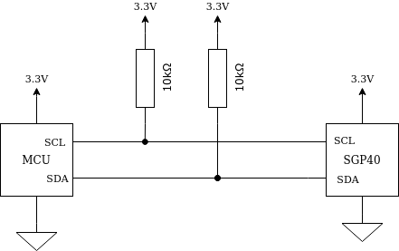
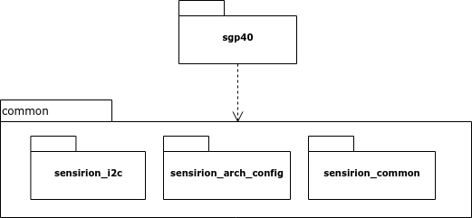

This application note will provide you with an introduction to the SGP40
driver.

Overview
========

This driver works with just a single SGP40 sensor and provides you with the raw
output signal of the sensor. If you are looking for a more complete solution
with humidity compensation and an algorithm to calculate the VOC Index, take a
look at the SGP40 VOC Index Driver bundle.

Hardware Setup
==============

The hardware setup uses a I2C bus to connect the sensor to the micro controller
unit (MCU). Connect the sensor according to the datasheet. Remember to add
pull-up resistors for SCL and SDA (10kOhm).

Software Overview
=================

The software is split into the following modules:

 * *common*: Contains abstractions for I2C, the MCU architecture and some
   common helpers
 * *sgp40* The driver for the SGP40 sensor

