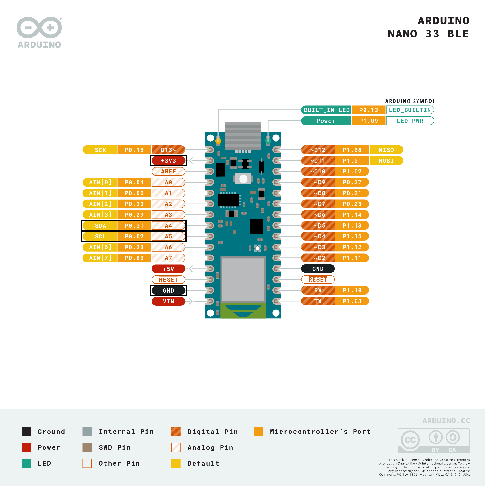

SGP40 on Arduino Platforms
==========================

This guide describes how to get the SGP40 gas sensor working on Arduino
platforms. It offers a step by step guide to get basic functionality working.

Preperation
-----------

First of all note that the most commonly used Arduino boards have a logic level
of 5V but the SGP40 can only run at 3.3V and lower. We offer two suggestions
how to solve this. First you could use a `level shifter
<https://en.wikipedia.org/wiki/Level_shifter>`_ board to connect your SGP40,
alternatively you could use one of the few Arduino boards which run on 3.3V.
For this guide we did the later and used the Arduino Nano 33 BLE.

To flash the Arduino Board with a program you need to download and install the
Arduino IDE. You can find guides how to do that on the Arduino Webpage:
Windows: https://www.arduino.cc/en/Guide/Windows
Linux: https://www.arduino.cc/en/Guide/Linux
Mac OS: https://www.arduino.cc/en/Guide/MacOSX

Connecting the Sensor
---------------------

Your sensor has the four different connectors: VCC, GND, SDA, SCL. Now you need
to connect the sensor to the correct pins on your board. To find out which pins
are the correct ones consult the pinout of your specific board. You can find
these on the Arduino website. Look for SDA to connect the sensors SDA pin, for
SCL to connect the SCL pin, GND for the GND pin and a 3.3V supply for the VCC
pin. Since we use the Arduino NANO 33 BLE as an example here a pinout of it
with the correct pins marked:

|Arduino Pinout|

Flashing Arduino Board
----------------------

Start by downloading the ``sgp40-arduino-VERSION.zip`` release form the
Sensirion Github page (https://github.com/Sensirion/embedded-sgp/releases).
Unpack the ``.zip`` file and navigate into the resulting directory. Click on
the ``.ino`` file, this should start the Arduino IDE and open the project. If
it doesn't work start the Arduino IDE, in the top bar click on File, Open... ,
navigate to the unziped folder and open the ``.ino`` file.

For most 3.3V boards you need to install an additional package to be able to
flash them via the Arduino IDE. This is done selecting Tools, then Boards and
last Boards Manager. Then you can type the name of your board in the search bar
and install the upcoming package.

|Boardmanager|

Now you only need to upload the code to your board. Connect your Arduino board
with your computer using an USB cable. Then you'll need to select the entry in
the Tools, Board menu that corresponds to your Arduino board. Finally you also
need to select the right port where your Arduino is connected. For this
navigate to Tools, Port and select the one indicating that your board is
connected there (name of your board at the end in brackets). If no port is
indicating that a board is connected it's likely to be COM3. To now upload your
code to your board click the arrow icon in the top lefthand corner. This
process can take a while.

Checkout Sensor Data
--------------------

To look at the senor data open the serial monitor by navigating to Tools,
Serial Monitor. If everything worked fine and your Arduino is still connected
you now should see the measuring data of the Sensor.

::

    VOC Index: 132
    Temperature: 28.41degC
    Relative Humidity: 40.68RH
    VOC Index: 129
    Temperature: 28.32degC
    Relative Humidity: 40.54RH
    VOC Index: 127
    Temperature: 28.25degC
    Relative Humidity: 40.59RH
    VOC Index: 125
    Temperature: 28.30degC
    Relative Humidity: 40.89RH
    VOC Index: 124
    Temperature: 28.33degC
    Relative Humidity: 41.57RH
    VOC Index: 124
    Temperature: 28.35degC
    Relative Humidity: 42.17RH
    VOC Index: 124
    Temperature: 28.26degC
    Relative Humidity: 41.92RH
    ...

Troubleshooting
---------------

Initialization failed
~~~~~~~~~~~~~~~~~~~~~

-  Check if you connected the sensor correctly, so all cables are fully
   plugged in and connected to the correct header.

VOC Index is zero
~~~~~~~~~~~~~~~~~

During the initialization phase of the VOC Index algorithm, which is the first
100 iterations, the VOC Index will output zero.

Arduino Nano 33 BLE doesn't show up in port list
~~~~~~~~~~~~~~~~~~~~~~~~~~~~~~~~~~~~~~~~~~~~~~~~

Try double tapping or long pressing the reset button located on the top of the Arduino board.
When the orange LED on the board (next to the Micro USB) lights up the Arduino should show up.
Otherwise use a different USB cable, restart the IDE and reconnect the Arduino.

.. |Boardmanager| image:: ./images/Boardmanager.png
