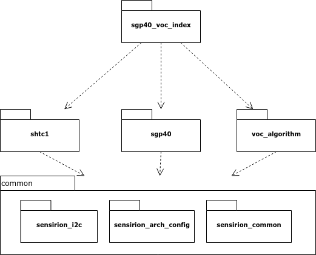

This application note will provide you with an introduction to the SGP40 VOC
Index driver bundle.

Overview
========

This bundle combines Sensirion's SGP40 and SHTC3 sensors to provide a humidity
compensated sensor signal. It further embeds a VOC algorithm that
post-processes the raw sensor output into the resulting VOC Index.

Hardware setup
==============

The hardware setup uses a single I2C bus where both sensors are connected to
the micro controller unit (MCU). Connect the sensors according to the
datasheet. Remember to add pull-up resistors for SCL and SDA (10kOhm).

.. image:: ./images/hardware-setup.png
    :align: center
    :width: 50%

Software Overview
=================

The software is split into the following modules:

 * *common*: Contains abstractions for I2C, the MCU architecture and some
   common helpers
 * *shtc1* The driver for the SHTC3 sensor (also compatible with SHTC1, SHTW1
   and SHTW2)
 * *sgp40* The driver for the SGP40 sensor
 * *voc_algorithm* The VOC algorithm to process the raw sensor signal and
   calculate the VOC index.
 * *sgp40_voc_index* Combines the two drivers and the VOC algorithm to provide
   a simple API.

API
---

The example *sgp40_voc_index_example_usage.c* gives a starting point on how to
use the sensors.

The SGP40 VOC Index driver provides the following functions:

.. doxygenfunction:: sensirion_init_sensors
.. doxygenfunction:: sensirion_measure_voc_index
.. doxygenfunction:: sensirion_measure_voc_index_with_rh_t
